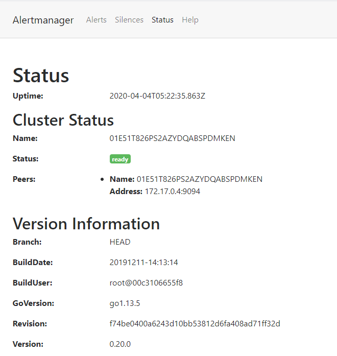
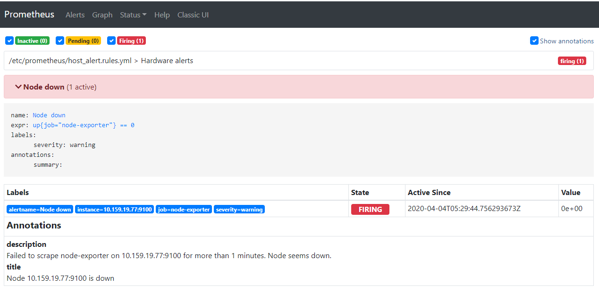
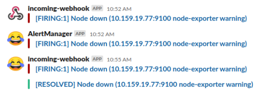

# Hướng dẫn cài đặt gửi cảnh báo khi có alert trên Prometheus

## Giải pháp:
 - Prometheus để lưu trữ metric và thiết lập cảnh báo
 - Alermanager để gửi cảnh bảo tới email, các OTT hỗ trợ Webhooks như Slack, Hipchat,...
 - Email hoặc Slack để nhận cảnh báo


## Mô hình lab:
 - Host vật lý: IP 10.159.19.77
 - Prometheus: IP 10.159.19.84
 - Alertmanager: IP 10.159.19.84

## 1. Cài đặt Node-exporter để thu thập metric container
### 1.1. Cài đặt node-exporter theo [hướng dẫn](https://github.com/longsube/ghichep-minIO/blob/master/docs/monitorHost_nodexporter%2Bprometheus%2Bgrafana.md)

## 2. Cài đặt Prometheus để lưu trữ tập trung metric và thiết lập cảnh báo
### 2.1. Cài đặt Prometheus theo [hướng dẫn](https://github.com/longsube/ghichep-prometheus-v2/blob/master/docs/install_prometheus_container.md)

### 2.2. Tạo file cấu hình `host_alert.rules.yml` chứa các rule cảnh báo
#### Trong bài lab này, nếu node-exporter trên host không hoạt động trong 1p, Prometheus sẽ đánh giá host down và gửi cảnh báo.
```sh
groups:
- name: Hardware alerts
  rules:
  - alert: Node down
    expr: up{job="node-exporter"} == 0
    for: 1m
    labels:
      severity: warning
    annotations:
      title: Node {{ $labels.instance }} is down
      description: Failed to scrape {{ $labels.job }} on {{ $labels.instance }} for more than 1 minutes. Node seems down.
```


### 2.3. Chỉnh sửa file `prometheus.yml` để thêm cấu hình cảnh báo
```sh
# Khai bao file chứa rule cảnh báo
rule_files:
  - 'host_alert.rules.yml'

# Khai báo địa chỉ alertmanager nhận cảnh báo
alerting:
  alertmanagers:
    - static_configs:
      - targets: ['10.159.19.84:9093']
```

### 2.4. Khởi tạo lại container Prometheus để nhận cấu hình mới
```sh
docker run -d --name prometheus -p 9090:9090 \
-v /root/prometheus/prometheus.yml:/etc/prometheus/prometheus.yml \
-v /root/prometheus/host_alert.rules.yml:/etc/prometheus/host_alert.rules.yml \
prom/prometheus  --config.file=/etc/prometheus/prometheus.yml
```
Trong đó:

 - `/root/prometheus/`: là đường dẫn của các file cấu hình vừa tạo ở bước trên.

### 2.5. Kiểm tra việc tạo rule
#### Truy cập vào địa chỉ `10.159.19.84:9090` để vào giao diện của Prometheus, vào `Status` -> `Rules`


## 3. Cài đặt Alertmanager để gửi cảnh báo
### 3.1. Lấy image alertmanager bản `latest`
```sh
docker pull prom/alertmanager
```

### 3.2. Tạo file cấu hình `alertmanager.yml`
```sh
mkdir alertmanager
cd alertmanager
vim alertmanager.yml
```

#### Nội dung file cấu hình
```sh
global:
  slack_api_url: 'https://hooks.slack.com/services/xxx/xxx'
templates:
- '/*.tmpl'
# The root route on which each incoming alert enters.
route:
  group_by: ['alertname', 'priority']
  group_wait: 3s
  group_interval: 5s
  repeat_interval: 1m
  # default route if none match
  receiver: alert-emailer
  # The labels by which incoming alerts are grouped together. For example,
  # multiple alerts coming in for cluster=A and alertname=LatencyHigh would
  # be batched into a single group.
  # TODO:
  # All the above attributes are inherited by all child routes and can
  # overwritten on each.
receivers:
- name: alert-emailer
  email_configs:
  - to: 'longsube@gmail.com'
    send_resolved: true
    from: 'cloud@email.vn'
    require_tls: true
    smarthost: 'smtp.email.vn:587'
    auth_username: 'cloud@email.vn'
    auth_password: 'abcxyz'
    auth_secret: 'cloud@email.vn'
    auth_identity: 'cloud@email.vn'
  slack_configs:
  - send_resolved: true
  # https://prometheus.io/docs/alerting/configuration/#slack_config 
    channel: 'test-webhooks'
    username: 'incoming-webhook'
    icon_emoji: ':joy:'
```

#### Chú ý: 
 - Các thông tin về `slack_api_url` và thông tin về email gửi, nhận, smtp cần thiết lập cho đúng với môi trường triển khai.
 - Cần đảm bảo Alertmanager có thể truy cập ra Mail server bên ngoài qua port được khai báo trong cấu hình (587 cho TLS)

### 3.3. Download file template, các cảnh báo sẽ kế thừa template này để gửi đi
```sh
wget https://raw.githubusercontent.com/prometheus/alertmanager/master/template/default.tmpl
```

### 3.4. Khởi tạo container Alertmanager
```sh
docker run -d --name alertmanager -p 9093:9093 \
-v /root/alertmanager/alertmanager.yml:/alertmanager.yml \
-v /root/alertmanager/default.tmpl:/default.tmpl \
prom/alertmanager --config.file=/alertmanager.yml
```
Trong đó:

 - `/root/alertmanager/`: là đường dẫn của các file cấu hình vừa tạo ở bước trên.

### 3.5. Kiểm tra
#### Truy cập vào địa chỉ `10.159.19.84:9093` để vào giao diện của Alertmanager. Trong `Status` đã có cấu hình cảnh báo


### 5. Cấu hình Webhooks cho Slack để nhận cảnh báo
### 5.1. Thực hiện theo [hướng dẫn](https://github.com/longsube/ghichep-OpenStack/blob/master/08-Ceilometer/operation/proxy_alarm_slack.md#2-c%E1%BA%A5u-h%C3%ACnh-slack)

## 6. Thử nghiệm việc gửi cảnh báo 
### 6.1. Tắt tạm thời node-exporter trên host vật lý, sau đó truy cập vào địa chỉ `10.159.19.84:9090` để vào giao diện của Prometheus, xuất hiện cảnh báo node down


### 6.2. Trên Alertmanager xuất hiện trigger để gửi cảnh báo


### 6.3. Kiểm tra email và Slack đã thấy có cảnh báo gửi về


## Tham khảo:

- https://medium.com/@abhishekbhardwaj510/alertmanager-integration-in-prometheus-197e03bfabdf
- https://blog.ruanbekker.com/blog/2019/05/17/install-alertmanager-to-alert-based-on-metrics-from-prometheus/
- https://hub.docker.com/r/prom/alertmanager/
- https://github.com/prometheus/alertmanager/blob/master/template/default.tmpl
- https://prometheus.io/docs/alerting/configuration/#email-receiver-
- https://www.robustperception.io/alerting-on-down-instances
- https://alex.dzyoba.com/blog/prometheus-alerts/